### Linux操作系统中断

- 什么是系统中断

    系统中断一般是指硬件中断和软件中断的综合，中断发生后，系统会停止响应，并执行中断响应

    所谓中断就是CPU对系统发生的某个时间做出的一种反应，CPU暂停正在执行的程序，保存现场后自动的
    转去执行响应的中断处理程序，处理完该事件后再返回继续执行被中断的程序

    - 硬中断，由系统的相连的外设如网卡、硬盘自动产生的，主要是用来通知操作系统外设状态的变化
    
    - 软中断，为了满足系统的实时性，中断处理应当越快越好。因此linux发生中断的时候，硬中断处理
    发生时间较短的，而将那些处理时间久的，放到中断后来完成，也就是软中断完成

- 中断的分类

  - 由CPU外部引起的，称作中断，如I/O中断、时钟中断、控制台中断等
  
  - 来自CPU的内部事件或程序执行中的事件引起的过程，称为异常。如由于CPU本身故障、程序故障(浮点溢出、地址越界)等引起
  
  - 在程序中使用了请求系统服务的系统调用而引发的过程，称为"陷入"。前两类通常都称作为中断，它们往往都是无意的被动的，
  而陷入是有意的和主动的

- 系统中断，内核会做什么事情

  - 保存正在运行进程的各寄存器的内容，把他们放入核心栈的新帧面中
  
  - 确定"中断源"或者核查中断发生，是被中断的类型和中断的设备。系统接到中断后，就从机器哪里得到一个中断号，它是检索
  中断向量偏移表的位移
    
  - 核心调用中断处理程序，对中断进行处理
  
  - 中断处理完成并返回。中断处理程序执行完以后，核心便执行与机器相关的特定指令序列，恢复中断时寄存器内容和执行核心栈退出，
  进入到用户态

---  

### 用户态和内核态

- 内核态
  
  CPU可以访问内存的所有数据，设备等，CPU也可以将自己从一个程序切换到另一个程序
  
- 用户态

  只能访问受限的内存，且不允许访问设备，CPU资源可以被切换到其他的进程

- 为什么区分

  由于需要限制不同的程序之间的访问能力，防止他们获取别的程序的内存数据，或者设备数据，发送到网络等。CPU因此划分两个权限等级

- 工作流程

  - 用户态程序将一些数据值放在寄存器中, 或者使用参数创建一个堆栈(stack frame), 以此表明需要操作系统提供的服务
  
  - 用户态程序执行陷阱指令
  
  - CPU切换到内核态, 并跳到位于内存指定位置的指令, 这些指令是操作系统的一部分, 他们具有内存保护, 不可被用户态程序访问
  
  - 这些指令称之为陷阱(trap)或者系统调用处理器(system call handler)。他们会读取程序放入内存的数据参数, 并执行程序请求的服务

  - 系统调用完成后, 操作系统会重置CPU为用户态并返回系统调用的结果
  
--- 

### Socket读写缓存区

- 每个Socket被创建后，都会分配两个缓冲区，输入缓存区和输出缓冲区

- write()/send()并不会立即向网络发送数据，而是先将数据写入缓冲区中，再由TCP/IP协议从缓存区中发送到目标机器，
一旦数据写入到数据缓冲区，函数就可以成功返回，不管他们有没有发送到目标及其，也不管合适发送，这些都是TCP/IP协议负责的

- 合适发送和如何发送都是TCP/IP协议控制，取决于当时网络情况，当时线程是否空闲等诸多因素  

- read()/recv()函数也是如此，也从缓冲区读取数据，而不是直接从网络中读取

- 输入输出缓冲区的默认大小一般为8K

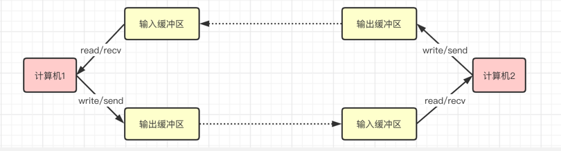

---

### 数据的读取

- 进程A创建Socket，操作系统会创建一个由文件系统管理的Socket对象，这个Socket对象包括了输入输出缓冲区以及等待队列。
等待队列是非常重要的结构，它指向了要等待该Socket事件的进程
  
- 因此当进程A调用Recv的时候，操作系统就会把A移动到Socket的等待队列中，此时A线程让出了CPU，进入等待唤醒

- 当Socket接收到数据的时候，网卡将数据存储到内存中，然后网卡发出中断信号，中断信号根据信号表查找到相应的中断程序，并执行。
中断程序的主要任务就是: 1.将收到的数据写入到Socket缓存区中，再唤醒进程A，并给与A分配CPU
  
- 进程A进入了执行队列，就可以执行recv后的代码

- 这也是为什么BIO会阻塞的原因

---

### Select()

Linux网络编程函数，在一段指定的事件内，监听用户感兴趣的文件描述符上可读、可写和异常等事件

- 调用Select()，传递给select函数的参数告诉内核

  - 我们关心的文件描述符
  - 对每个描述符，我们所关心的状态
  - 我们要等待多久时间
  
- 调用函数的返回信息

  - 对我们的要求已经做好准备的描述符个数
  - 对于三种条件那些描述符已经做好了准备(读、写、异常)
  
- int select (int maxfd + 1,fd_set *readset,fd_set *writeset,
  fd_set *exceptset,const struct timeval * timeout);
  
  - 参数1，最大的文件描述符 + 1
  - 参数2，用于检查可读的文件描述符Id集合
  - 参数3，用户检查可写的文件描述符Id集合
  - 参数4，用于检查异常的文件描述符Id集合
  - 参数5，一个执行timeval结构的指针，用于决定select等待I/O的最长时间
    - timeout == NULL 无限等待
    - timeout->tv_sec == 0 && timeout->tv_usec == 0不等待，直接返回
    - timeout->tv_sec !=0 || timeout->tv_usec!=0 等待指定时间

      struct timeval {
        long tv_sec;  //seconds
        long tv_usec; // microsenconds
      }

- struct fd_set可以理解为一个集合，这个集合用来存放的是文件描述符，即文件句柄，可以是我们所说的普通意义上的文件，
当然unix下任意设备、管道等都是文件格式，这里指的是socket句柄
  
  - 实际上是int类型数据，每个数组元素都能与一打开的文件句柄建立联系
  - 简历联系的工作是开发人员完成的
  - 调用完select()以后，由内核根据IO状态修改fd_set的内容，由此来通知select()的进程哪一socket发生了改变
  - 主要是给一个长度，然后每个位表示每个文件的状态，分别用状态位表示
  
- 相应的linux提供了一组宏，用来为fd_set进行赋值等操作

  - int FD_ZERO(fd_set *fdset); // 将FD_ZERO宏将一个fd_set类型变量的所有位都设置为0
  - int FD_CLR(int fd, fd_set *fdset) // 清除某个位
  - int FD_SET(int fd, fd_set *fdset) // 将指定位置的bit设置为1
  - int FD_ISSET(int fd, fd_set *fdset) // 判断某个位是否被置位
  
- int maxfdp1参数指带测试的描述符个数，它的值是待测试的最大描述符+1

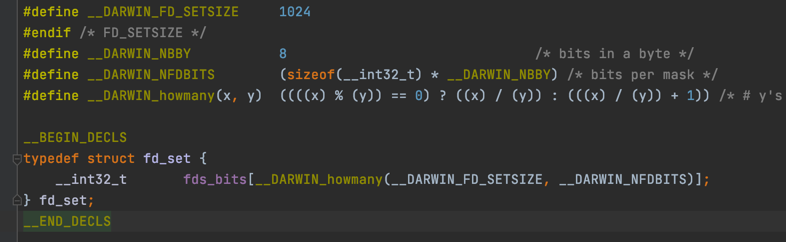

    #include <stdio.h>
    #include <sys/time.h>
    #include <unistd.h>
    #include <sys/socket.h>
    #include <netinet/in.h>
    #include <arpa/inet.h>
    #include <string.h>
    #include <stdlib.h>
    
    int main() {
        const char* ip = "127.0.0.1";
        int port = 8080;
        printf("ip: %s. port: %d\n", ip, port);
    
        int ret = 0;
        // 定义主机地址
        struct sockaddr_in address;
        bzero(&address, sizeof(address));
        address.sin_family = AF_INET;
        inet_pton(AF_INET,ip,&address.sin_addr);
        address.sin_port = htons(port);
    
        // 监听socket的fd，即服务器的fd
        int listenfd = socket(PF_INET,SOCK_STREAM,0);
        if(listenfd < 0){
            printf("Fail to create listen socket!\n");
            return -1;
        }
    
        // 绑定端口
        ret = bind(listenfd,(struct sockaddr*)&address,sizeof(address));
        if(ret == -1) {
            printf("Fail to bind socket!\n");
            return -1;
        }
    
        // 监听文件描述符，/监听队列最大排队数设置为5
        ret = listen(listenfd, 5);
        if(ret == -1) {
            printf("Fail to listen socket!\n");
            return -1;
        }
    
        // 记录进行连接的客户端的地址
        struct sockaddr_in client_address;
        socklen_t client_addrlength = sizeof(client_address);
    
        // 监听客户端连接，这里可以改为while监听
        int connfd = accept(listenfd,(struct sockaddr*)&client_address,&client_addrlength);
        if(connfd < 0) {
            printf("Fail to accept!\n");
            close(listenfd);
        }
    
        char buff[1024]; //数据接收缓冲区
        fd_set read_fds;  //读文件操作符
        fd_set exception_fds; //异常文件操作符
        FD_ZERO(&read_fds);
        FD_ZERO(&exception_fds);
    
        while(1) {
            memset(buff,0,sizeof(buff));
            /*每次调用select之前都要重新在read_fds和exception_fds中设置文件描述符connfd，因为事件发生以后，文件描述符集合将被内核修改*/
            FD_SET(connfd,&read_fds);
            FD_SET(connfd,&exception_fds);
    
            // select相应的文件描述符
            ret = select(connfd+1,&read_fds,NULL,&exception_fds,NULL);
            if(ret < 0) {
                printf("Fail to select!\n");
                return -1;
            }
    
            // 可读
            if(FD_ISSET(connfd, &read_fds)) {
                ret = recv(connfd,buff,18,0);
                if(ret <= 0) {
                    break;
                }
    
                printf("get %d bytes of normal data: %s \n",ret, buff);
            }
            else if(FD_ISSET(connfd,&exception_fds)) //异常事件
            {
                ret = recv(connfd,buff,sizeof(buff)-1,MSG_OOB);
                if(ret <= 0)
                {
                    break;
                }
    
                printf("get %d bytes of exception data: %s \n",ret,buff);
            }
        }
    
        close(connfd);
        close(listenfd);
    
        return 0;
    }

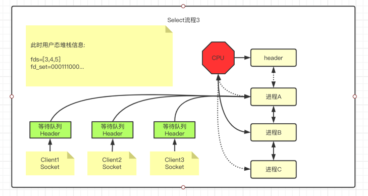

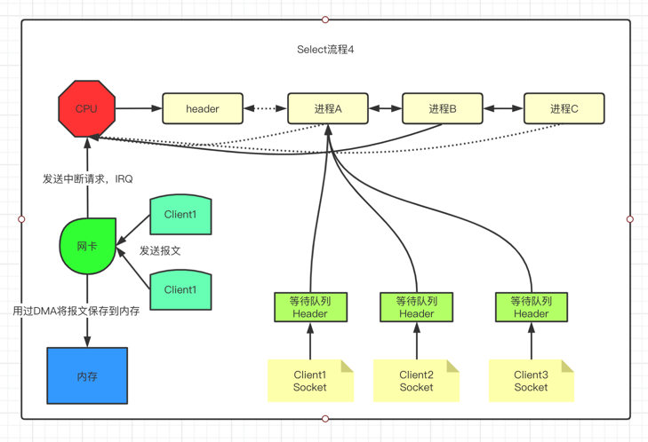

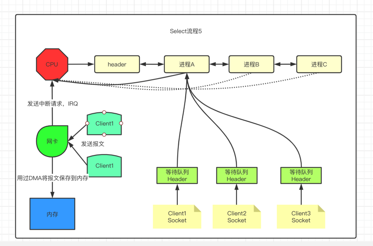

---

### Epoll

Epoll是在2.6内核中提出的，是之前select和poll的增强版本，相较于select和poll，epoll更加灵活，没有描述符限制。
Epoll使用一个文件描述符管理多个描述符，将用户关心的文件描述符的事件保存到内核的一个事件列表中，这样在用户空间和内存空间只需要一次Copy

- int epoll_create(int size);

  - 是一个系统函数，函数将在内核空间开辟一块新的空间，可以理解为epoll结构空间，返回值为epoll文件描述符编号，方便后续的操作

- int epoll_ctl(int epfd, int op, int fd, struct epoll_event *event);

  - Epoll的事件注册函数，epoll与select不同，select函数是调用指定需要监听的描述符和时间，epoll先将用户感兴趣的描述符事件注册到Epoll空间内，
  此函数是非阻塞函数，作用仅仅是增删改Epoll空间内的描述符信息
  - 参数描述
    - 参数1，epfd，即Epoll结构的进程fd编号
    - 参数2，op，当前请求类型，即操作类型，EPOLL_CTL_ADD(注册新的fd到epfd)、EPOLL_CTL_MOD(修改已注册的fd监听事件)、EPOLL_CTL_DEL(删除指定的fd)
    - 参数3，fd，需要监听的文件描述符，一般指socket_fd
    - 参数4，event，告诉内核对该fd感兴趣的事件
  

    struct epool_event {
      _uint32 events; /* epoll events */
      epoll_data t_data; /* User data variable */
    }

- int epoll_wait(int epfd, struct epoll_event *events, int maxevents, int timeout);

  - 等待事件的产生，类似于select调用，根据参数的timeout，来决定是否阻塞
  - 参数描述
    - 参数1，epfd，即Epoll结构的进程fd编号
    - 参数2，*events，是一个指针，必须指向一个epoll_event数据结构，当函数返回时，内核会把就绪状态的数据拷贝到该数组中
    - 参数3，maxevents，标明参数2中epoll_event数组最多能接收的数据量，即本次操作最多能获取多少就绪数据
    - timeout，单位为毫秒，0:表示立即返回，非阻塞、-1:阻塞调用，直到有用户感兴趣事件就绪位置、>0:阻塞调用，阻塞指定时间内如果有事件就绪则提前返回，否则
    等待指定超时时间后返回
  - 返回值，本次就绪的fd个数
  
- 工作模式，LT(水平触发)和ET(边缘触发)、LT是默认模式

  - LT: 事件就绪后，用户可以选择处理或者不处理，如果用户本次来处理，那么下次调用epoll_await时候仍然会返回将来处理的事件打包给你
  - ET: 事件就绪后，用户必须处理，因为内核不给兜底，内核把就绪的事件打包给你后，对应的事件就被清除掉了
  
- 由于Mac不支持Epoll，而是Kqueue，所以就不添加代码了

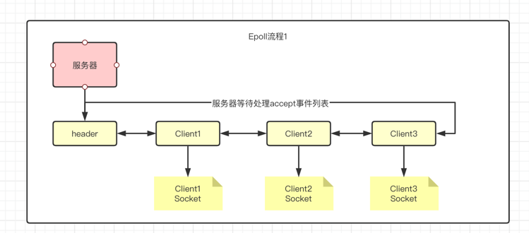

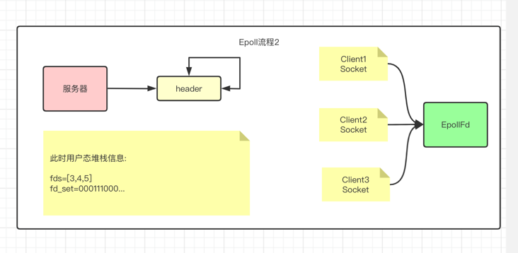

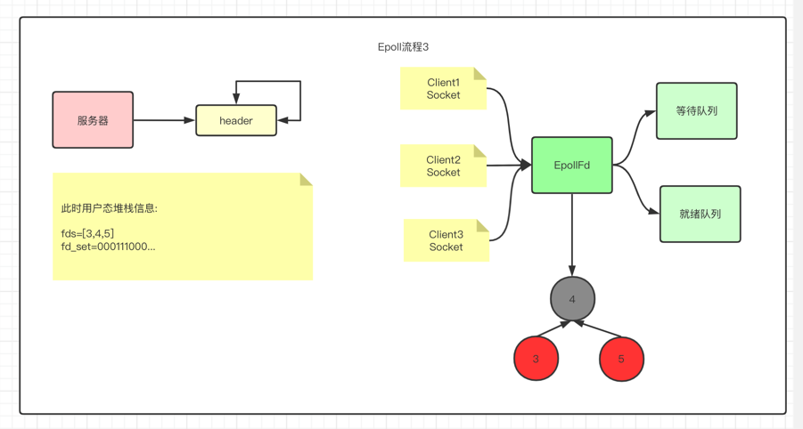

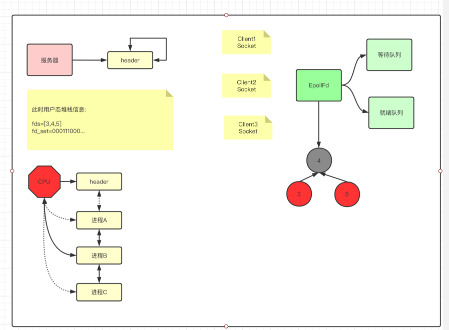

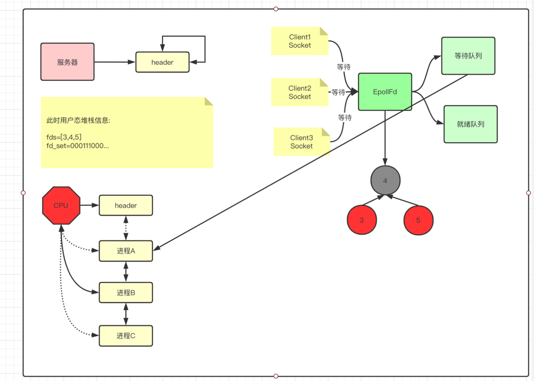

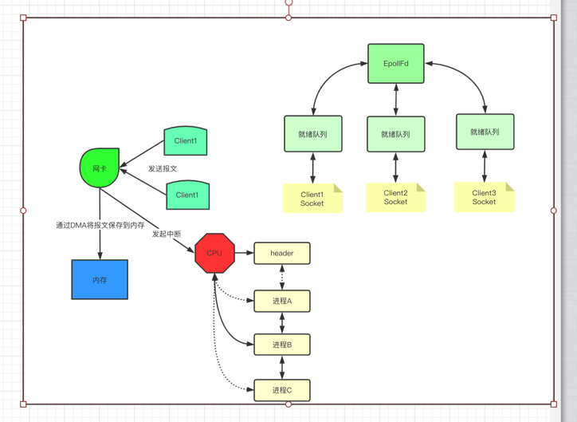

---

### kqueue

kqueue则是unix系统提供的IO多路复用技术，据说性能比epoll更加强，因为epoll存在一个缺陷就是每次添加感兴趣的事件的时候
都需要调用epoll_ctl方法，如果感兴趣100个事件，则需要调用100次。但是kqueue可以添加多个感兴趣的事件，因此性能上会比
epoll好一些

综上述，如果想看更加详细的代码实现的话，可以参考redis源码里的select/epoll/kqueue等

