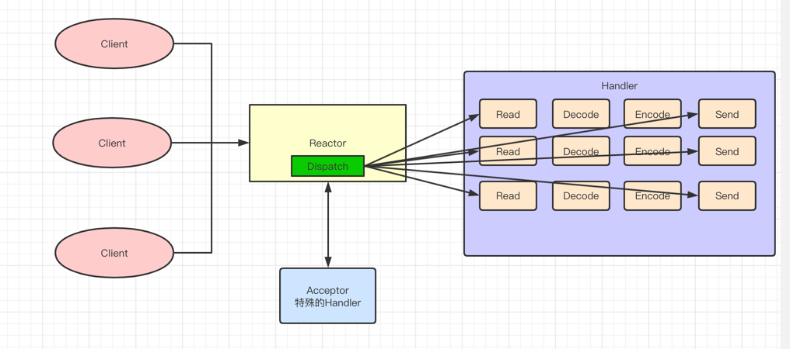
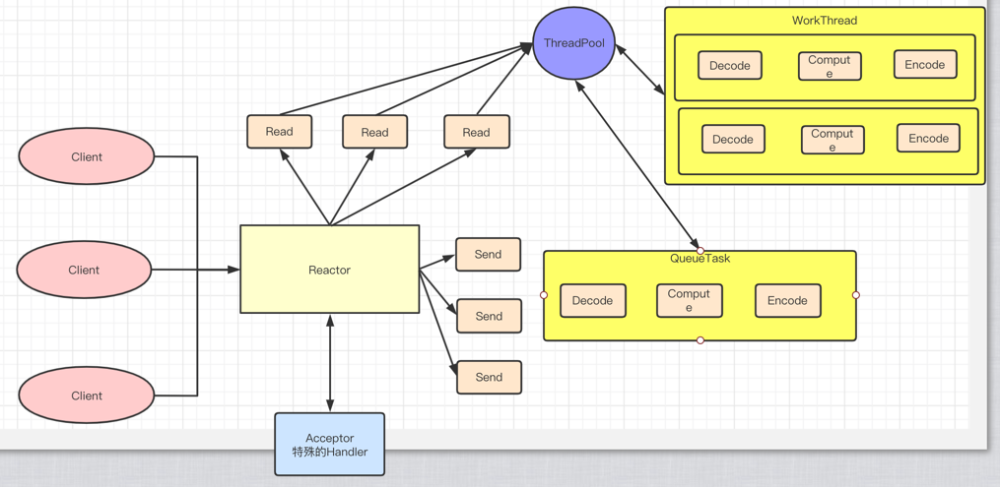

### Reactor模型介绍

Reactor模型也叫反应器模式，大多数IO相关组件如Netty、Redis都在使用IO模式，为什么需要这种模式呢，
而且如何解决高并发的呢

### 多线程IO存在的问题

- 原始的IO编程
  
这种编程方式就是服务器一直循环，不断监听端口有没有新的链接，如果有就处理。这种方式
最大的问题就是不能支持高并发，效率低。如果当前服务没有处理完，后续的就要阻塞

    
    while(true) {
        socket = accept();
        handle(socket);
    }

- 使用多线程处理，每个连接都是用一个线程处理
    
    - 优点，一定程度上提高了服务器的吞吐量，因为当前处理的连接不会阻塞后续的
    
    - 缺点，一个连接一个线程资源要求太高了，系统中创建线程需要比较高的系统资源，如果连接数太多，系统无法承担怎么高的负载。
    而且系统的创建和销毁是需要代价的。那为什么不能一个线程处理多个连接呢，因为连接分配到一个线程上仍然要排队和阻塞

    - 如何改进，采用事件驱动，当有事件触发的时候，才会调用处理器进行数据处理。使用Reactor模型，对线程的数量进行控制，一个线程
    处理大量事件
      

    public class ServerRunnable implements Runnable {
    
        @Override
        public void run() {
            try {
                ServerSocket ss = new ServerSocket(8080);
                while (!Thread.interrupted()) {
                    new Thread(new HandlerRunnable(ss.accept())).start();
                }
            } catch (IOException e) {
                e.printStackTrace();
            }
            
        }
        
        static class HandlerRunnable implements Runnable {
    
            final Socket socket;
            
            HandlerRunnable(Socket socket) {
                this.socket = socket;
            }
    
            @Override
            public void run() {
                try {
                    byte[] array = new byte[1024];
                    socket.getInputStream().read(array);
                    // to process array
                } catch (IOException e) {
                    e.printStackTrace();
                }
            }
        }
    }

### 单线程Reactor

实际上的Reactor模式，是基于JavaNIO的。在这个基础上，抽象出来两个组件，Reactor和Handler

- Reactor: 负责响应IO事件，当检查到一个新的事件，将其发送给相应的Handler去处理，新的事件包含连接"就绪"、"读就绪"、"写就绪"等事件
   - 什么是单线程Reactor，其中Reactor是多面手，负责多路分离套接字，Accept新链接，并分派请求到Handler处理器中  
   
- Handler：将自身Handler与事件绑定，负责事件的处理，完成Channel的读入、完成业务逻辑后，负责将结果写出channel
    
- 缺点   
    - 当其中某一个Handler阻塞的时候，会导致其他所有的client的Handler也得不到执行，并且严重的是，Handler的阻塞也会导致整个服务不能接收新的Client请求
    - 因此单线程Reactor的模型使用的比较少，仅仅适用于Handler中业务组件能快速完成的场景
    

使用JavaNIO实现最朴素的Reactor模型，即单个Handler和单个Reactor，在代码里没体现

    public class Server {
    
        public static void main(String[] args) throws IOException {
            // 打开Selector选择器，实现类分别有SelectorProvider、PollSelectorProvider、KQueueSelectorProvider、EpollSelectorProvider
            Selector selector = Selector.open();
    
            // 打开通道
            ServerSocketChannel channel = ServerSocketChannel.open();
            // 设置成为非阻塞的
            channel.configureBlocking(false);
            // 绑定端口
            channel.bind(new InetSocketAddress(8080));
            // 将通道注册到选择器上，并注册操作为"接收"操作
            channel.register(selector, SelectionKey.OP_ACCEPT);
    
            // 轮训获取"准备就绪"，注册过的操作
            while (selector.select() > 0) {
                Iterator<SelectionKey> it = selector.selectedKeys().iterator();
                while (it.hasNext()) {
                    // 获取处于就绪的事件
                    SelectionKey selectionKey = it.next();
                    // 判断Key是具体做什么事件
                    if (selectionKey.isAcceptable()) {
                        // 获取客户处于准备就绪的连接
                        SocketChannel socketChannel = channel.accept();
                        socketChannel.configureBlocking(false);
                        // 将该通道注册到selector选择器上
                        socketChannel.register(selector, SelectionKey.OP_READ);
                    } else if (selectionKey.isReadable()) {
                        // 当前选择器为"读就绪"状态，这里的channel就是上面accept里面的那个channel
                        SocketChannel socketChannel = (SocketChannel) selectionKey.channel();
                        ByteBuffer byteBuffer = ByteBuffer.allocate(1024);
                        int length = 0;
                        while ((length = socketChannel.read(byteBuffer)) != -1) {
                            byteBuffer.flip();
                            System.out.println(new String(byteBuffer.array(), 0, length));
                            byteBuffer.clear();
                        }
                        socketChannel.close();
                    }
                    it.remove();
                }
            }
            
            channel.close();
        }
    }

单线程Reactor的参考代码

    public class Reactor implements Runnable {
    
        final Selector selector;
    
        final ServerSocketChannel serverSocketChannel;
    
        Reactor(int port) throws IOException {
            selector = Selector.open();
            serverSocketChannel = ServerSocketChannel.open();
            serverSocketChannel.socket().bind(new InetSocketAddress(port));
            serverSocketChannel.configureBlocking(false);

            SelectionKey sk = serverSocketChannel.register(selector, SelectionKey.OP_ACCEPT);
            // 将负责处理Accept事件的处理交由Acceptor线程去做
            sk.attach(new Acceptor());
        }
    
        @Override
        public void run() {
            while (!Thread.interrupted()) {
                try {
                    selector.select();
                    Set<SelectionKey> selectionKeys = selector.selectedKeys();
                    Iterator<SelectionKey> it = selectionKeys.iterator();
                    while (it.hasNext()) {
                        dispatch(it.next());
                    }
                    selectionKeys.clear();
                } catch (IOException e) {
                    e.printStackTrace();
                }
            }
        }
        
        // 各自取各自的附件线程，如果是Accept就交由Accept处理，如果是读写就交由Handler线程处理
        void dispatch(SelectionKey key) {
            Runnable r = (Runnable) key.attachment();
            if (r != null) {
                // 此处会阻塞 ！！！
                r.run();
            }
        }
    
        class Acceptor implements Runnable {
    
            @Override
            public void run() {
                SocketChannel channel = serverSocketChannel.accept();
                if (channel != null) {
                    // 接收到一个channel后就交由Handler处理
                    new Handler(selector, channel);
                }
            }
        }
        
        // 注册感兴趣的事件，然后交由Reactor的Run去跑循环，然后dispatch分发后处理
        class Handler implements Runnable {
            
            final SocketChannel channel;
            final Selector selector;
            final SelectionKey sk;
            ByteBuffer input = ByteBuffer.allocate(1024);
            ByteBuffer output = ByteBuffer.allocate(1024);
            
            static final int READING = 0, SENDING = 1;
            
            int state = READING;
            
            Handler(Selector selector, SocketChannel channel) throws IOException {
                this.selector = selector;
                this.channel = channel;
                this.channel.configureBlocking(false);
                sk = this.channel.register(selector, READING);
                sk.attach(this);
                sk.interestOps(SelectionKey.OP_READ);
                selector.wakeup();
            }
    
            // 处理由Reactor派发来的事件
            @Override
            public void run() {
                if (state == READING) {
                    try {
                        channel.read(input);
                        state = SENDING;
                        sk.interestOps(SelectionKey.OP_WRITE);
                    } catch (IOException e) {
                        e.printStackTrace();
                    }
                } else if (state == SENDING) {
                    try {
                        channel.write(output);
                        sk.cancel();;
                    } catch (IOException e) {
                        e.printStackTrace();
                    }
                }
            }
        }
    }
    
### 多线程Reactor

- 基于线程池的改进

    - 将Handler处理器的执行放入到线程池中，多线程进行业务处理
    - 对于Reactor而言，可以仍为单线程，如果服务器为多核的CPU，为充分利用系统资源，可以将Reactor拆分为多个线程
    

参考代码

    public class MultiReactor {
    
        // 其他部分不变
    
        class MultiHandler implements Runnable {
    
            final SocketChannel channel;
    
            final SelectionKey selectionKey;
    
            ByteBuffer input = ByteBuffer.allocate(1024);
            ByteBuffer output = ByteBuffer.allocate(1024);
            static final int READING = 0, SENDING = 1;
            int state = READING;
    
            ExecutorService pool = Executors.newFixedThreadPool(2);
    
            static final int PROCESSING = 3;
    
            MultiHandler(Selector selector, SocketChannel c) throws IOException {
                channel = c;
                c.configureBlocking(false);
                selectionKey = channel.register(selector, RE);
                selectionKey.attach(this);
                selectionKey.interestOps(SelectionKey.OP_READ);
                selector.wakeup();
            }
    
            @Override
            public void run() {
                if (state == READING)
                {
                    read();
                }
                else if (state == SENDING)
                {
                    send();
                }
            }
            
            void read() {
                try {
                    channel.read(input);
                    state = PROCESSING;
                    pool.execute(new Processor());
                } catch (IOException e) {
                    e.printStackTrace();
                }
    
            }
            
            void send() {
                try {
                    channel.write(output);
                    selectionKey.cancel();
                } catch (IOException e) {
                    e.printStackTrace();
                }
            }
    
            class Processor implements Runnable {
    
                @Override
                public void run() {
                    // 去做业务吧
                    
                    state = SENDING;
                    selectionKey.interestOps(SelectionKey.OP_WRITE);
                }
            }
        }
    }

### 将Reactor修改为多线程

对应多个CPU的机器，为了充分使用系统资源，将Rector拆分为2个部分

    public class MultiReactor implements Runnable {
    
        Selector[] selectors=new Selector[2];
        int next = 0;
        final ServerSocketChannel serverSocket;
    
        MultiReactor() throws IOException {
            selectors[0] = Selector.open();
            selectors[1]= Selector.open();
            serverSocket = ServerSocketChannel.open();
            serverSocket.socket().bind(new InetSocketAddress(8080));
            //非阻塞
            serverSocket.configureBlocking(false);
    
    
            //分步处理,第一步,接收accept事件
            SelectionKey sk =
                serverSocket.register( selectors[0], SelectionKey.OP_ACCEPT);
            //attach callback object, Acceptor
            sk.attach(new Acceptor());
        }
    
        @Override
        public void run() {
    
            try
            {
                while (!Thread.interrupted())
                {
                    for (int i = 0; i <2 ; i++)
                    {
                        selectors[i].select();
                        Set selected =  selectors[i].selectedKeys();
                        Iterator it = selected.iterator();
                        while (it.hasNext())
                        {
                            //Reactor负责dispatch收到的事件
                            dispatch((SelectionKey) (it.next()));
                        }
                        selected.clear();
                    }
    
                }
            } catch (IOException ex) {
                ex.printStackTrace();
            }
        }
    
        void dispatch(SelectionKey k)
        {
            Runnable r = (Runnable) (k.attachment());
            if (r != null) {
                r.run();
            }
        }
    }

### Reactor模型的优缺点

- 优点

    - 响应快，不必为单个同步时间所阻塞，虽然Reactor本身是同步的
    - 编程现对简单，可以很大程度的避免复杂的多线程同步问题，以及解决了多线程切换的开销
    - 可扩展性，可以通过增加Reactor实例个数充分利用CPU资源
    - 可复用性，Reactor本身与具体时间处理逻辑无关，具有很高的复用性

- 缺点

    - 相较于传统的编程，增加了复杂性以及要一定的门槛，并且不容易调试
    - Reactor需要底层Asynchronous Event Multiplexer支持，比如Java中的Selector支持，操作系统的Selector系统调用支持等
    - Reactor模式在IO读写数据时还是在同一个线程中实现的，即便使用多个Reactor机制下，那么共享一个Reactor的Channel如果出现了
    一个长时间的数据读写，也会影响这个Reactor中其他Channel的相应时间
